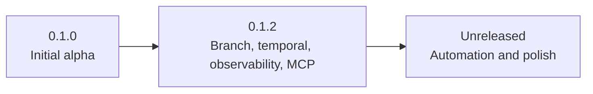

# Changelog

All notable changes to this project will be documented in this file.

The format is based on [Keep a Changelog](https://keepachangelog.com/en/1.1.0/),
and this project follows [Semantic Versioning](https://semver.org/spec/v2.0.0.html).

## Release map

| Version      | Date        | Focus                                                            |
| ------------ | ----------- | ---------------------------------------------------------------- |
| `0.1.0`      | 2026-04-19  | Initial public alpha runtime and CX-LINK foundation              |
| `0.1.2`      | 2026-04-19  | Branch/temporal workflows, observability, MCP, proactive context |
| `Unreleased` | In progress | Release automation and documentation sync                        |

## [Unreleased]

### Added

- No-args primary CLI interactive shell mode (`pnpm run cortexa`) that starts daemon by default and accepts inline commands.
- Top-level command normalization for `--<command>` forms and `agent` alias routing to `agents`.
- Ingestion scope integration coverage (`test:ingestion-scope`) validating workspace-scoped chat ingestion and `.venv` skip behavior.

### Changed

- Git release automation now auto-tags `v<package-version>` on `main` version bumps via GitHub Actions; tag push continues to build and publish GitHub Releases.
- Ingest command UX now supports optional path and project-id inference from target folder.
- Ingestion pipeline now skips common heavy local/runtime directories (`.venv`, `venv`, `.cache`, `target`, etc.).
- Copilot chat transcript discovery now prefers current workspace-scoped `workspaceStorage` before broader root fallback.
- Documentation refreshed across README/runbook/API/contributing to match current CLI and ingestion behavior.

### Fixed

- Daemon start now handles already-running instances and `EADDRINUSE` conflicts without crashing command flow.
- Vector backend outage handling now applies retry cooldown to avoid repeated slow failures while continuing SQLite-first operations.
- Interactive shell exit now returns cleanly (`exit` path returns code `0`) and stops in-process daemon when owned by that shell.

## [0.1.2] - 2026-04-19

### Added

- Structured JSON logging for daemon HTTP/self-healing lifecycle.
- Prometheus metrics export endpoint with request and scheduler counters.
- Built-in daemon rate limiting controls.
- Full stdio MCP transport with modular tool routing.
- MCP codec tools (`cortexa_encode_mcp_ctx`, `cortexa_decode_mcp_ctx`).
- Security hardening guide and observability guide.
- Branch-aware memory model with `memory_branches`, copy-on-write branch overlays, and tombstones.
- Temporal memory snapshots with `asOf` retrieval and `/cxlink/temporal/query` + `/cxlink/temporal/diff` endpoints.
- Branch management APIs and CLI commands (`branch list/create/merge/switch`).
- Intent-aware proactive context suggestions (`/context/suggest`) with stream events (`contextSuggested`, `branchSwitched`).
- MCP tools for branch, temporal, and proactive flows (`cortexa_context_suggest`, `cortexa_temporal_*`, `cortexa_branch_*`).
- Integration test coverage for branch + temporal + proactive flows (`test:branch-temporal`).

### Changed

- Daemon health payload now reports observability configuration.
- CI now runs MCP and observability-focused tests.
- Core query/context/cxlink flows now accept `branch` and `asOf` options end-to-end.
- Ingestion pipeline now supports branch-scoped writes and branch-aware stale cleanup behavior.

## [0.1.0] - 2026-04-19

### Added

- Initial public alpha release with local-first memory runtime, daemon APIs, compaction pipeline, and CX-LINK protocol support.
