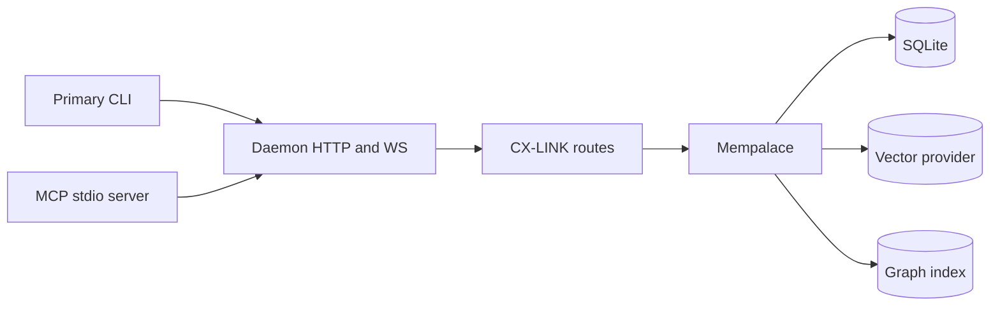

<div align="center">
  
  <h1>CORTEXA</h1>
  <p><strong>Local-First Cognitive Runtime & Developer Memory OS</strong></p>
  <p>
    
    
    
  </p>
</div>

<br />

CORTEXA is a local-first memory runtime for software development workflows. It ingests code and chat history, stores optimized memory units, retrieves relevant context with hybrid ranking, and compiles prompt-ready context for coding agents and tools.

**CX-LINK** is CORTEXA’s context exchange protocol: a stable contract for turning retrieval results + constraints into agent-ready envelopes (`/cxlink/context`, `/cxlink/query`, `/cxlink/plan`).

This README is fully updated for:
- primary `cortexa` CLI wiring (ingestion, resurrection, compaction, dashboard)
- no-args interactive shell mode (`pnpm run cortexa`) with default daemon startup and clean `exit`
- primary `cortexa` progression evolve command telemetry
- compaction + deterministic resurrection pipeline
- third-wave compaction dashboard payload with trend snapshots and per-project risk/anomaly reporting
- daemon HTTP/WS routes and operational scripts
- top-level command normalization (`--daemon`, `--memory`, etc.) and `agent` alias support
- branch-aware memory forking/merge workflows (`main` + custom branches)
- temporal retrieval + diff APIs for time-travel context reconstruction (`asOf`)
- intent-aware proactive context suggestions and daemon stream events (`contextSuggested`, `branchSwitched`, `agentStatus`, `sessionResurrectionStatus`)
- ingestion defaults + performance hardening (optional path/projectId inference, workspace-scoped chat discovery, expanded skip dirs, vector retry cooldown)
- unified agent orchestration surface (planner/refactor/writer/critic/compressor + evolution and multi-agent loop)

## System map



## Surface at a glance

| Surface     | Primary purpose                         | Key paths                                                                        |
| ----------- | --------------------------------------- | -------------------------------------------------------------------------------- |
| CLI         | Local operator and developer workflows  | `ingest`, `query`, `context`, `agents`, `memory`, `daemon`                       |
| Daemon HTTP | Programmatic runtime APIs               | `/query`, `/context`, `/evolve`, `/cxlink/*`                                     |
| Daemon WS   | Stream lifecycle/status events          | `contextSuggested`, `branchSwitched`, `agentStatus`, `sessionResurrectionStatus` |
| MCP stdio   | Tool bridge for MCP clients             | `tools/list`, `tools/call`                                                       |
| Mempalace   | Memory retrieval and compaction runtime | snapshots, branch overlay, temporal diff/query                                   |

---

## What’s in CORTEXA today

- **Hybrid memory store (`Mempalace`)**
  - SQLite metadata (`better-sqlite3`)
  - vector index provider: `qdrant` / `chroma` / in-memory fallback
  - branch-aware overlay model with copy-on-write rows + branch tombstones
  - temporal snapshot timeline for as-of retrieval and memory diffs
- **Ingestion pipeline**
  - code parsing/chunking + AST-derived hints
  - optional Copilot chat transcript/session ingestion
- **Compaction + resurrection**
  - compact envelope format: `cortexa://mem/compact/v1/`
  - Brotli payload + checksum verification
  - deterministic resurrection at read/retrieval time
- **Compaction analytics**
  - stats, dry-run/apply backfill, dashboard payloads
  - persisted trend snapshots (`memory_compaction_snapshots`)
  - integrity anomaly tracking (`invalidChecksum`, `decodeError`)
- **Self-healing scheduler hardening**
  - persisted scheduler run history (`self_healing_run_history`) across restarts
  - exponential backoff on repeated run failures
  - rolling-window SLO counters for `applied` / `dry-run-only` / `skipped` / `error`
- **Session-resurrection scheduler**
  - background code/chat ingestion + graph memory indexing (`graph_nodes`, `graph_edges`)
  - session and temporal lineage links for resurrection-aware memory navigation
  - persisted run history (`session_resurrection_run_history`) with backoff + SLO windows
- **Observability + hardening**
  - structured JSON logging for daemon HTTP and scheduler lifecycle
  - Prometheus metrics export (`/metrics`) with HTTP + self-healing + session-resurrection dimensions
  - built-in rate limiting controls for daemon APIs
- **Context compiler**
  - token-bounded packing
  - copilot-friendly content summaries (`copilotContent`) for lower token cost
  - branch/as-of aware retrieval threading
  - intent-aware proactive suggestion hints (topK/tokens/scope/constraints)
- **MCP stdio transport**
  - full JSON-RPC framing over stdio for MCP-compatible clients
  - modular tool catalog bridging daemon + CX-LINK APIs
  - MCP context codec tools (`cortexa_encode_mcp_ctx` / `cortexa_decode_mcp_ctx`)
- **Daemon APIs + WS stream**
  - query/context/evolve/cxlink + compaction endpoints
  - session-resurrection scheduler status/trigger endpoints
  - branch management and temporal diff/query endpoints
  - agent list/run orchestration endpoints for blueprint-aligned multi-agent workflows
  - stream deltas for `contextSuggested`, `branchSwitched`, `agentStatus`, and `sessionResurrectionStatus`

---

## Architecture (high level)

```text
Primary CLI (cortexa)
  ├── ingest        (code/chat ingestion)
  ├── query         (hybrid retrieval)
  ├── context       (token-bounded context compile)
  ├── agents        (list/run unified Cortexa agents)
  ├── memory        (list/search/get/resurrect/delete/stats/backfill/dashboard)
  ├── dashboard     (alias => memory dashboard)
  └── daemon        (local HTTP + WS runtime)
           ↓
Mempalace (core memory engine)
  ├── SQLite metadata + snapshots
  ├── Vector index (Qdrant/Chroma/InMemory)
  ├── Compaction + resurrection layer
  └── Retrieval + ranking + context formatting
```

---

## Prerequisites

- Node.js `^20.11.1` or `^22.0.0`
- `pnpm@9.15.0`

---

## Setup

```bash
git clone <your-repo-url>
cd Cortexta
pnpm install
pnpm run build
```

Optional health checks:

```bash
pnpm run doctor
pnpm run typecheck
```

---

## Docs Index

- [`docs/api-examples.md`](docs/api-examples.md) — Copy/paste JSON request and response examples for all daemon endpoints.
- [`docs/operator-runbook.md`](docs/operator-runbook.md) — Day-1 and Day-2 operational workflows (setup, maintenance, compaction, troubleshooting).
- [`docs/cxlink-spec.md`](docs/cxlink-spec.md) — CX-LINK protocol spec (concepts, contract, versioning, route semantics).
- [`docs/mcp-server.md`](docs/mcp-server.md) — MCP stdio transport setup, tool surface, and client wiring.
- [`docs/observability.md`](docs/observability.md) — Structured logs + Prometheus metrics + scrape guidance.
- [`docs/security.md`](docs/security.md) — Security hardening controls for auth, rate limiting, inputs, and container sandboxing.
- [`docs/containerization.md`](docs/containerization.md) — Docker/Docker Compose setup for daemon + Qdrant.
- [`CONTRIBUTING.md`](CONTRIBUTING.md) — Contribution workflow, quality gates, and PR checklist.
- [`CHANGELOG.md`](CHANGELOG.md) — Release history and notable change tracking.

---

## 5-minute workflow (end-to-end)

```bash
pnpm install
pnpm run doctor

# optional: interactive mode (starts daemon by default)
pnpm run cortexa

# 1) ingest project memory
pnpm run cortexa -- ingest . --max-files=500 --no-include-chats
# projectId auto-inferred from folder name unless overridden

# 2) retrieve and compile context
pnpm run cortexa -- query "how is cxlink context assembled?"
pnpm run cortexa -- context "add a new daemon route with tests"

# 3) run progression telemetry
pnpm run cortexa -- evolve "improve progression selection quality" --project-id=my-project --dry-run --json

# 4) run integrated agents (including blueprint multi-agent loop)
pnpm run cortexa -- agents list
pnpm run cortexa -- agents run multi_agent_loop "stabilize agent routing + telemetry" --project-id=my-project --dry-run --json

# 5) run daemon for API clients
pnpm run cortexa:daemon

# 6) (optional) run MCP stdio transport for external MCP clients
pnpm run cortexa:mcp
```

In another terminal (optional API smoke check):

```bash
curl -s http://localhost:4312/health
curl -s -X POST http://localhost:4312/cxlink/context -H "content-type: application/json" -d '{"query":"wire telemetry","projectId":"my-project"}'
```

---

## Primary CLI (source of truth)

Use the primary CLI through:

```bash
pnpm run cortexa -- <command> [args]
```

> The `--` delimiter is intentionally supported/normalized in the primary CLI.
> Top-level `--<command>` forms (example: `--daemon`) are also normalized.
>
> Running `pnpm run cortexa` with no command starts daemon (if needed) and opens the interactive `cortexa>` shell.

### Command reference

#### `init`

Initialize SQLite schema + vector collection bootstrap.

```bash
pnpm run cortexa -- init
```

#### `ingest`

Ingest code and (by default) chat sessions.

```bash
pnpm run cortexa -- ingest [path] [options]
```

Options:
- `--project-id=<id>` (optional; defaults to the target folder name)
- `--branch=<name>` (default `main`)
- `--no-include-chats`
- `--no-skip-unchanged` (force full re-ingest)
- `--skip-unchanged=<true|false>`
- `--max-files=<n>`
- `--max-chat-files=<n>`
- `--chat-root=<path>`

Notes:
- `path` is optional; if omitted, current working directory is used.
- chat ingestion discovers transcripts from matching VS Code `workspaceStorage` first (when resolvable), then falls back to broader roots.
- common heavyweight directories (`.venv`, `venv`, `.cache`, `target`, etc.) are skipped during code walk.

Examples:

```bash
pnpm run cortexa -- ingest
pnpm run cortexa -- ingest .
pnpm run cortexa -- ingest . --project-id=my-service --max-files=1500 --max-chat-files=500
pnpm run cortexa -- ingest . --no-include-chats
```

#### `query`

Hybrid memory retrieval.

```bash
pnpm run cortexa -- query "how did we harden websocket streaming?"
pnpm run cortexa -- query "why is auth flow failing" --project-id=my-service --branch=feature/auth --top-k=12 --min-score=0.4 --as-of=1713433000000
```

#### `context`

Compile a prompt-ready context payload.

```bash
pnpm run cortexa -- context "add retry-safe checkpointing"
pnpm run cortexa -- context "stabilize flaky integration tests" --project-id=my-service --branch=release/next --as-of=1713433000000 --top-k=14 --max-tokens=5200
```

#### `evolve`

Run progression-aware memory evolution from freeform text and surface stage telemetry.

```bash
pnpm run cortexa -- evolve "upgrade evolution progression telemetry"
```

Options:
- `--project-id=<id>` (default `default`)
- `--context=<text>` (optional context hint)
- `--dry-run` (compute progression without persisting)
- `--json` or `--format=json` (emit full telemetry payload)

#### `agents`

List and run the unified Cortexa agent catalog (heuristic, evolution, and orchestration loop).

```bash
pnpm run cortexa -- agents list
pnpm run cortexa -- agents run planner "design migration safety checks" --project-id=my-service --branch=release/next --dry-run
pnpm run cortexa -- agents run multi_agent_loop "prepare full implementation strategy" --project-id=my-service --dry-run --json
pnpm run cortexa -- agents run multi_agent_loop "persist evolution result" --project-id=my-service --apply
```

`agent` is accepted as a top-level alias for `agents`.

Subcommands:
- `list` → returns all available agents with family + mutation metadata
- `run <agent> <text>` → executes a specific agent (`writer`, `critic`, `compressor`, `planner`, `refactor`, `evolution_writer`, `evolution_critic`, `evolution_consolidator`, `evolution_archivist`, `multi_agent_loop`)

Common options:
- `--project-id=<id>`
- `--branch=<name>`
- `--context=<text>`
- `--dry-run` (default mode)
- `--apply` (opt-in persistence / mutation mode)
- `--top-k=<n>`
- `--max-chars=<n>`
- `--json` or `--format=json`

#### `daemon`

Manage local daemon runtime.

```bash
pnpm run cortexa
pnpm run cortexa -- daemon start
pnpm run cortexa -- --daemon status
pnpm run cortexa -- daemon status
pnpm run cortexa -- daemon stop
```

When daemon is started in-process by no-args interactive mode, typing `exit` cleanly shuts it down before process exit.

#### `memory`

Memory lifecycle + compaction ops.

```bash
pnpm run cortexa -- memory <action> [args/options]
```

Actions:

- `list [projectId] [--limit=<n>] [--branch=<name>] [--as-of=<unix-ms>]`
- `search <query> [--project-id=<id>] [--branch=<name>] [--as-of=<unix-ms>] [--top-k=<n>] [--min-score=<0..1>]`
- `get <id> [--project-id=<id>] [--branch=<name>] [--as-of=<unix-ms>] [--full]`
- `resurrect <id> [--project-id=<id>] [--branch=<name>] [--as-of=<unix-ms>] [--full]`
- `delete <id> [--project-id=<id>] [--branch=<name>]`
- `branch list --project-id=<id>`
- `branch create <branch> --project-id=<id> [--from-branch=<name>] [--forked-from-commit=<sha>]`
- `branch merge <source> <target> --project-id=<id> [--strategy=<source-wins|target-wins>]`
- `branch switch <target> --project-id=<id> [--from-branch=<name>]`
- `temporal diff --project-id=<id> [--branch=<name>] --from=<unix-ms> --to=<unix-ms> [--limit=<n>]`
- `stats [--project-id=<id>]`
- `audit [--project-id=<id>] [--limit=<n>] [--max-issues=<n>] [--json]`
- `backfill [--project-id=<id>] [--limit=<n>] [--apply]`
- `dashboard [dashboard-options]`

Examples:

```bash
pnpm run cortexa -- memory list --limit=20
pnpm run cortexa -- memory search "compaction checksum"
pnpm run cortexa -- memory branch create feature/auth-refactor --project-id=Cortexta --from-branch=main
pnpm run cortexa -- memory branch merge feature/auth-refactor release/next --project-id=Cortexta --strategy=source-wins
pnpm run cortexa -- memory temporal diff --project-id=Cortexta --branch=feature/auth-refactor --from=1713432000000 --to=1713434000000
pnpm run cortexa -- memory resurrect <id>
pnpm run cortexa -- memory stats --project-id=Cortexta
pnpm run cortexa -- memory audit --project-id=Cortexta --limit=5000 --max-issues=10
pnpm run cortexa -- memory backfill --limit=2000           # dry-run by default
pnpm run cortexa -- memory backfill --limit=2000 --apply   # persist updates
```

#### `dashboard` (alias)

Equivalent to `memory dashboard ...`.

```bash
pnpm run cortexa -- dashboard --no-persist-snapshot --trend-rows=10 --top-projects=20
```

Dashboard options (primary CLI):
- `--json` or `--format=json`
- `--project-id=<id>`
- `--lookback-days=<n>`
- `--max-trend-points=<n>`
- `--max-projects=<n>`
- `--no-persist-snapshot`
- `--per-project-snapshot-limit=<n>`
- `--snapshot-retention-days=<n>`
- `--top-projects=<n>`
- `--trend-rows=<n>`
- `--out-json=<path>`
- `--out-human=<path>`

---

## Standalone scripts

### Compaction maintenance script

```bash
pnpm run compact:memory -- --limit=1000
pnpm run compact:memory -- --projectId=Cortexta --limit=5000 --apply
```

- dry-run by default
- `--apply` to persist

### Dashboard script

```bash
pnpm run dashboard:compaction -- --help
pnpm run dashboard:compaction -- --no-persist-snapshot
pnpm run dashboard:compaction -- --json --out-json=./tmp/dashboard.json
pnpm run dashboard:compaction -- --out-human=./tmp/dashboard.txt
```

Output modes:
- human-readable terminal report (default)
- JSON payload for automation (`--json` / `--format=json`)

---

## Daemon APIs

Start daemon:

```bash
pnpm run cortexa -- daemon start
```

Base default:
- HTTP: `http://localhost:4312`
- WS: `ws://localhost:4321`

### Auth

- If `CORTEXA_DAEMON_TOKEN` is set (and not placeholder), send either:
  - header `x-cortexa-token: <token>`
  - or `Authorization: Bearer <token>`

### Routes

- `GET /health`
- `GET /metrics`
- `POST /ingest`
- `POST /query`
- `POST /context`
- `POST /context/suggest`
- `POST /evolve`
- `POST /evolve/progression`
- `POST /cxlink/context`
- `POST /cxlink/query`
- `POST /cxlink/plan`
- `POST /cxlink/agent/list`
- `POST /cxlink/agent/run`
- `POST /cxlink/branch/list`
- `POST /cxlink/branch/create`
- `POST /cxlink/branch/merge`
- `POST /cxlink/branch/switch`
- `POST /cxlink/temporal/query`
- `POST /cxlink/temporal/diff`
- `POST /cxlink/compaction/stats`
- `POST /cxlink/compaction/backfill`
- `POST /cxlink/compaction/dashboard`
- `POST /cxlink/compaction/audit`
- `POST /cxlink/compaction/self-heal/status`
- `POST /cxlink/compaction/self-heal/trigger`
- `POST /cxlink/session-resurrection/status`
- `POST /cxlink/session-resurrection/trigger`

`/cxlink/context`, `/cxlink/query`, and `/cxlink/plan` responses now also include a `memoryHealth` signal so agent runtimes can react to compaction/anomaly posture.

`/query`, `/context`, `/cxlink/context`, `/cxlink/query`, and `/cxlink/plan` accept branch-aware and temporal options (`branch`, `asOf`).

`/context` and `/query` now return an intent-aware `suggestion`; `/context/suggest` provides a dedicated proactive endpoint with optional warmup context compilation.

`/cxlink/agent/list` and `/cxlink/agent/run` expose the integrated agent catalog and execution path, including the blueprint-style `multi_agent_loop` orchestrator.

The daemon health payload now includes summarized self-healing and session-resurrection scheduler status (`enabled`, `started`, `running`, `nextRunAt`, `lastScheduledDelayMs`, `consecutiveFailures`, `lastOutcome`, `runCount`, `slo`).

`POST /evolve` supports two modes:
- **consolidate mode** (existing behavior): no `text` field, runs compaction-style consolidation preview/apply over stored memories.
- **progression mode** (new): include `text` (and optional `context`) to run `evolveWithProgression(...)` and return stage telemetry (`progression`).

`POST /evolve/progression` is a strict alias for progression mode and always requires `text` (returns `400` when missing).

---

## Compaction + resurrection model

### Envelope format

- Prefix: `cortexa://mem/compact/v1/`
- Encoded envelope includes:
  - codec (`br64`)
  - original char count
  - preview text
  - payload (Brotli)
  - optional checksum

### Read-time behavior

- `getMemoryById()` and memory retrieval paths resurrect compacted content.
- `copilotContent` is generated as token-bounded preview content for context compilation.
- Integrity anomalies are tracked as:
  - `invalidChecksum`
  - `decodeError`

### Dashboard snapshot persistence

- Snapshot table: `memory_compaction_snapshots`
- Stores global + selected per-project snapshots
- Drives trend views and risk/anomaly reporting

### Self-healing run history persistence

- Scheduler history table: `self_healing_run_history`
- Persists every scheduler/manual run payload so status survives daemon restarts
- Powers rolling-window SLO counters exposed by status + health payloads

### Session-resurrection run history persistence

- Scheduler history table: `session_resurrection_run_history`
- Persists every scheduler/manual run payload so session + temporal indexing status survives daemon restarts
- Powers rolling-window SLO counters exposed by `/cxlink/session-resurrection/status` and `/health`

---

## Configuration (env vars)

### Core storage/vector

- `CORTEXA_DB_PATH` (default: `data/cortexa.db`)
- `CORTEXA_VECTOR_PROVIDER` (`qdrant` | `chroma` | `memory`, default `qdrant`)
- `CORTEXA_VECTOR_URL` (Qdrant endpoint, default `http://localhost:6333`)
- `CORTEXA_CHROMA_URL` (Chroma endpoint, default `http://localhost:8001`)
- `CORTEXA_EMBEDDING_URL` (optional external embedding service)

### Ingestion

- `CORTEXA_INGEST_MAX_FILE_BYTES` (default: `786432`)

### Compaction tuning

- `CORTEXA_MEM_COMPACT_MIN_CHARS`
- `CORTEXA_MEM_COMPACT_MIN_WIN_RATIO`
- `CORTEXA_MEM_COMPACT_PREVIEW_CHARS`
- `CORTEXA_MEM_COPILOT_PREVIEW_CHARS`
- `CORTEXA_MEM_COMPACT_BROTLI_QUALITY`

### Daemon

- `CORTEXA_DAEMON_PORT` (default `4312`)
- `CORTEXA_WS_PORT` (default `4321`)
- `CORTEXA_DAEMON_TOKEN`
- `CORTEXA_DAEMON_BODY_LIMIT` (default `6mb`)
- `CORTEXA_DAEMON_AUTOSTART` (`0` disables module auto-start)

### Observability + rate limiting

- `CORTEXA_LOG_ENABLED` (default `true`)
- `CORTEXA_LOG_LEVEL` (`trace|debug|info|warn|error|fatal`, default `info`)
- `CORTEXA_METRICS_ENABLED` (default `true`)
- `CORTEXA_METRICS_PATH` (default `/metrics`)
- `CORTEXA_METRICS_REQUIRE_AUTH` (default `true`)
- `CORTEXA_METRICS_COLLECT_DEFAULTS` (default `true`)
- `CORTEXA_DAEMON_RATE_LIMIT_ENABLED` (default `true`)
- `CORTEXA_DAEMON_RATE_LIMIT_WINDOW_MS` (default `60000`)
- `CORTEXA_DAEMON_RATE_LIMIT_MAX` (default `240`)

### MCP server transport

- `CORTEXA_MCP_SERVER_NAME` (default `cortexa-mcp`)
- `CORTEXA_MCP_SERVER_VERSION` (default `0.1.0`)
- `CORTEXA_MCP_PROTOCOL_VERSION` (default `2024-11-05`)
- `CORTEXA_MCP_DAEMON_URL` (default `http://127.0.0.1:4312`)
- `CORTEXA_MCP_DAEMON_TOKEN` (optional daemon auth token)
- `CORTEXA_MCP_TIMEOUT_MS` (default `20000`)
- `CORTEXA_MCP_ENABLE_MUTATIONS` (default `false`)
- `CORTEXA_MCP_LOG_LEVEL` (`debug|info|warn|error`, default `info`)

### Self-healing scheduler

- `CORTEXA_SELF_HEAL_ENABLED` (default `false`)
- `CORTEXA_SELF_HEAL_PROJECT_ID` (optional; default all projects)
- `CORTEXA_SELF_HEAL_INTERVAL_MS` (default `1800000`)
- `CORTEXA_SELF_HEAL_JITTER_MS` (default `60000`)
- `CORTEXA_SELF_HEAL_RUN_ON_START` (default `false`)
- `CORTEXA_SELF_HEAL_AUDIT_LIMIT` (default `5000`)
- `CORTEXA_SELF_HEAL_AUDIT_MAX_ISSUES` (default `20`)
- `CORTEXA_SELF_HEAL_BACKFILL_LIMIT` (default `5000`)
- `CORTEXA_SELF_HEAL_APPLY_ENABLED` (default `false`)
- `CORTEXA_SELF_HEAL_MAX_ALLOWED_ANOMALIES` (default `0`)
- `CORTEXA_SELF_HEAL_MIN_OPPORTUNITY_RATE` (default `0.2`)
- `CORTEXA_SELF_HEAL_MIN_DRY_RUN_COMPACTED_ROWS` (default `50`)
- `CORTEXA_SELF_HEAL_MAX_APPLY_ROWS` (default `2000`)
- `CORTEXA_SELF_HEAL_APPLY_WINDOW_START_HOUR` (default `1`)
- `CORTEXA_SELF_HEAL_APPLY_WINDOW_END_HOUR` (default `5`)
- `CORTEXA_SELF_HEAL_HISTORY_LIMIT` (default `50`)
- `CORTEXA_SELF_HEAL_PERSIST_HISTORY` (default `true`)
- `CORTEXA_SELF_HEAL_PERSISTED_HISTORY_LIMIT` (default `2000`)
- `CORTEXA_SELF_HEAL_BACKOFF_ENABLED` (default `true`)
- `CORTEXA_SELF_HEAL_BACKOFF_MULTIPLIER` (default `2`)
- `CORTEXA_SELF_HEAL_BACKOFF_MAX_INTERVAL_MS` (default `min(8x interval, 24h)`)
- `CORTEXA_SELF_HEAL_SLO_WINDOWS_MINUTES` (default `60,1440,10080`)

### Session-resurrection scheduler

- `CORTEXA_SESSION_RESURRECTION_ENABLED` (default `false`)
- `CORTEXA_SESSION_RESURRECTION_PROJECT_PATH` (required for automatic ingestion/indexing)
- `CORTEXA_SESSION_RESURRECTION_PROJECT_ID` (optional; defaults to project folder name)
- `CORTEXA_SESSION_RESURRECTION_BRANCH` (default `main`)
- `CORTEXA_SESSION_RESURRECTION_INTERVAL_MS` (default `900000`)
- `CORTEXA_SESSION_RESURRECTION_JITTER_MS` (default `30000`)
- `CORTEXA_SESSION_RESURRECTION_RUN_ON_START` (default `false`)
- `CORTEXA_SESSION_RESURRECTION_INCLUDE_CHATS` (default `true`)
- `CORTEXA_SESSION_RESURRECTION_SKIP_UNCHANGED` (default `true`)
- `CORTEXA_SESSION_RESURRECTION_MAX_FILES` (optional)
- `CORTEXA_SESSION_RESURRECTION_MAX_CHAT_FILES` (default `400`)
- `CORTEXA_SESSION_RESURRECTION_CHAT_ROOT` (optional explicit chat search root)
- `CORTEXA_SESSION_RESURRECTION_GRAPH_LOOKBACK_HOURS` (default `336`)
- `CORTEXA_SESSION_RESURRECTION_GRAPH_LIMIT` (default `5000`)
- `CORTEXA_SESSION_RESURRECTION_GRAPH_SNAPSHOT_LIMIT` (default `5000`)
- `CORTEXA_SESSION_RESURRECTION_AUDIT_LIMIT` (default `5000`)
- `CORTEXA_SESSION_RESURRECTION_AUDIT_MAX_ISSUES` (default `20`)
- `CORTEXA_SESSION_RESURRECTION_BACKFILL_LIMIT` (default `2000`)
- `CORTEXA_SESSION_RESURRECTION_APPLY_ENABLED` (default `false`)
- `CORTEXA_SESSION_RESURRECTION_MAX_ALLOWED_ANOMALIES` (default `0`)
- `CORTEXA_SESSION_RESURRECTION_HISTORY_LIMIT` (default `50`)
- `CORTEXA_SESSION_RESURRECTION_PERSIST_HISTORY` (default `true`)
- `CORTEXA_SESSION_RESURRECTION_PERSISTED_HISTORY_LIMIT` (default `2000`)
- `CORTEXA_SESSION_RESURRECTION_BACKOFF_ENABLED` (default `true`)
- `CORTEXA_SESSION_RESURRECTION_BACKOFF_MULTIPLIER` (default `2`)
- `CORTEXA_SESSION_RESURRECTION_BACKOFF_MAX_INTERVAL_MS` (default `min(8x interval, 24h)`)
- `CORTEXA_SESSION_RESURRECTION_SLO_WINDOWS_MINUTES` (default `60,1440,10080`)

---

## Testing and verification

```bash
pnpm run typecheck
pnpm run test:unit
pnpm run test:observability
pnpm run test:mcp
pnpm run test:ingestion
pnpm run test:ingestion-scope
pnpm run test:self-healing
pnpm run test:session-resurrection
pnpm run test:compaction
pnpm run test:branch-temporal
pnpm run test:agents-realistic
pnpm run test:daemons
```

CI runs on GitHub Actions with a Node matrix (`20`, `22`) and an integration suite gate on Node `22`.

---

## Open-source and distribution

- License: [MIT](LICENSE)
- npm package metadata is configured for public distribution (`cortexa`)
- Runtime support: Node `^20.11.1` and `^22.0.0`
- release automation is available via GitHub Actions: version bump on `main` auto-tags `v<version>`, and tag push triggers release workflow (`v*.*.*`)

For containerized deployments, see [`docs/containerization.md`](docs/containerization.md).

---

## Troubleshooting

- **Unexpected daemon startup while running CLI command**
  - no-args mode (`pnpm run cortexa`) intentionally starts daemon + interactive shell.
  - command mode (`pnpm run cortexa -- <command>`) lazy-loads daemon command paths only.
- **`ingest` scans too much or appears slow**
  - ingestion now skips common heavy directories (`.venv`, `venv`, `.cache`, `target`, etc.) and scopes chat discovery to the current workspace when available.
  - tune with `--max-files`, `--max-chat-files`, `--no-include-chats`, and `CORTEXA_INGEST_MAX_FILE_BYTES`.
- **Vector backend unavailable messages**
  - CORTEXA falls back to SQLite lexical behavior and deterministic embeddings where possible.
  - vector operations enter a short retry cooldown to avoid repeated slow failures while backend is down.
- **Backfill did not persist**
  - `memory backfill` and `compact:memory` default to dry-run; use `--apply`.
- **No dashboard trend points**
  - enable snapshot persistence (don’t use `--no-persist-snapshot`) and run dashboard repeatedly.
- **Self-healing runs but never applies backfill**
  - check safety gates in status/last run reasons (`/cxlink/compaction/self-heal/status`), especially anomaly guardrail, opportunity threshold, and apply-window hours.
- **Self-healing scheduler keeps failing repeatedly**
  - check `consecutiveFailures`, `lastScheduledDelayMs`, and `slo.windows` in `/cxlink/compaction/self-heal/status` or `/health`.
  - if needed, widen `CORTEXA_SELF_HEAL_BACKOFF_MAX_INTERVAL_MS` and inspect latest `error` run payload in persisted history.
- **Session-resurrection scheduler does not run**
  - ensure `CORTEXA_SESSION_RESURRECTION_ENABLED=true` and `CORTEXA_SESSION_RESURRECTION_PROJECT_PATH` points to a valid project directory.
  - inspect `/cxlink/session-resurrection/status` for `lastRun.error`, `consecutiveFailures`, and `slo.windows`.
- **Session-resurrection never applies backfill**
  - inspect `/cxlink/session-resurrection/status` decision reasons (dry-run-only, anomalies, or ingestion errors).
  - verify `CORTEXA_SESSION_RESURRECTION_APPLY_ENABLED=true` and anomaly threshold settings.

---

## Package scripts quick list

```bash
pnpm run doctor
pnpm run build
pnpm run dev
pnpm run typecheck
pnpm run test:self-healing
pnpm run test:session-resurrection
pnpm run test:observability
pnpm run test:mcp
pnpm run test:ingestion
pnpm run test:ingestion-scope
pnpm run test:compaction
pnpm run test:branch-temporal
pnpm run test:agents-realistic
pnpm run test:daemons
pnpm run cortexa -- <command>
pnpm run cortexa:daemon
pnpm run cortexa:mcp
pnpm run compact:memory -- --limit=1000
pnpm run dashboard:compaction -- --help
```

---

<div align="center">
  <i>"Don't memorize tokens. Preserve and retrieve semantics."</i>
</div>
