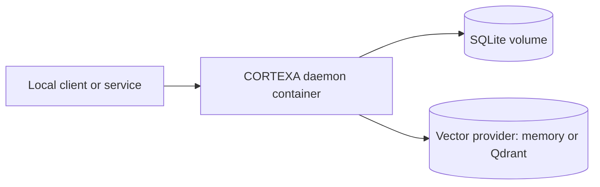

# Containerization Guide

This guide covers production-friendly container workflows for CORTEXA daemon runtime.

[← Back to README](../README.md)

---

## What you get

- multi-stage Docker build
- non-root runtime user
- healthcheck on `/health`
- optional Docker Compose setup with Qdrant

## Deployment topology



| Profile          | Components                                        | Best for                                |
| ---------------- | ------------------------------------------------- | --------------------------------------- |
| Single container | daemon + SQLite volume + `memory` vector provider | local validation and lightweight demos  |
| Compose stack    | daemon + SQLite volume + Qdrant                   | team reproducibility and parity testing |
| Hardened runtime | compose stack + TLS proxy + secrets manager       | production-like deployment posture      |

---

## Build image

```bash
docker build -t cortexa:latest .
```

## Run image (memory vector provider)

```bash
docker run --rm -p 4312:4312 -p 4321:4321 \
  -e CORTEXA_VECTOR_PROVIDER=memory \
  -e CORTEXA_DB_PATH=/var/lib/cortexa/cortexa.db \
  -v cortexa-data:/var/lib/cortexa \
  cortexa:latest
```

## Run with Docker Compose (daemon + qdrant)

```bash
docker compose up --build
```

This starts:

- `cortexa` daemon (`4312`, `4321`)
- `qdrant` vector store (`6333`)

---

## Environment variables to tune

- `CORTEXA_DAEMON_PORT` (default `4312`)
- `CORTEXA_WS_PORT` (default `4321`)
- `CORTEXA_DB_PATH` (default `data/cortexa.db`; in container use `/var/lib/cortexa/cortexa.db`)
- `CORTEXA_VECTOR_PROVIDER` (`memory`, `qdrant`, `chroma`)
- `CORTEXA_VECTOR_URL` (for qdrant/chroma backends)
- `CORTEXA_DAEMON_TOKEN` (recommended for non-local access)

---

## Quick health check

```bash
curl -s http://localhost:4312/health
```

---

## Notes

- For local-first development, `pnpm run cortexa:daemon` remains the fastest loop.
- For team reproducibility and deployment parity, prefer Docker Compose with pinned image tags.
