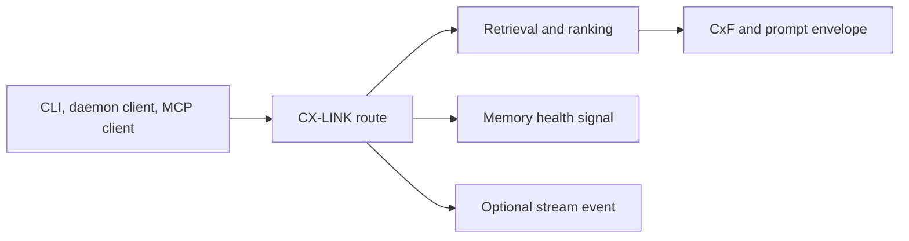

# CX-LINK Specification (v0.1)

CX-LINK is CORTEXA’s context exchange protocol for agent-facing workflows.

It standardizes how query intent, retrieved memory evidence, constraints, and token-budget metadata are packaged for downstream assistants (CLI, daemon clients, MCP-compatible tools).

## Goals

- deterministic context packaging for coding agents
- bounded context budgets with predictable token accounting
- stable payloads for retrieval, planning, and execution clients
- explicit health signaling for memory quality-aware orchestration
- branch-aware context isolation with deterministic lineage fallback
- temporal (as-of) memory reconstruction and change introspection
- proactive intent hints for pre-tuned retrieval envelopes

## Protocol overview



## Route families at a glance

| Family                | Routes                                             | Primary output                                                  |
| --------------------- | -------------------------------------------------- | --------------------------------------------------------------- |
| Context/query/plan    | `/cxlink/context`, `/cxlink/query`, `/cxlink/plan` | CxF, envelope, ranked results, `memoryHealth`                   |
| Agent orchestration   | `/cxlink/agent/list`, `/cxlink/agent/run`          | agent catalog and run output + `agentStatus` event              |
| Branch + temporal     | `/cxlink/branch/*`, `/cxlink/temporal/*`           | lineage control, historical retrieval, timeline deltas          |
| Compaction operations | `/cxlink/compaction/*`                             | stats, audit, dashboard, self-heal state and trigger            |
| Session resurrection  | `/cxlink/session-resurrection/*`                   | scheduler status, manual run, `sessionResurrectionStatus` event |

## Core concepts

### 1) CxF (Context Exchange Format)

CxF is a compact textual descriptor that captures:

- `intent`
- `scope`
- optional constraints/operational hints

Example:

```text
intent: introduce retention alerting
scope: project + memory + retrieval
```

### 2) Prompt envelope

The envelope is the full prompt-ready artifact produced by CX-LINK adapter logic.

Canonical sections:

- `[SYSTEM]` (optional)
- rendered context body
- `[CONTEXT_STATS]` (optional: tokens/atoms/dropped)
- `[USER_QUERY]`

This is generated by `buildPromptEnvelope(...)` in `packages/core/src/cxlink/adapter.ts`.

### 3) Memory health signal

CX-LINK routes include `memoryHealth` to expose runtime memory posture:

- `status`: `healthy | warning | critical`
- `compactionRate`
- `savedPercent`
- `anomalyTotal`
- recommendation text

This allows orchestrators to adapt behavior (e.g., run audit/backfill before high-stakes tasks).

### 4) Branch-aware context scope

CX-LINK supports explicit memory branch scoping via `branch`:

- default branch: `main`
- custom branches inherit context through parent lineage
- branch-local writes are copy-on-write overlays
- branch tombstones mask inherited memories when deleted in child branches

This enables safe experimentation and task-specific memory contexts without mutating `main`.

### 5) Temporal retrieval (`asOf`) and diff

Temporal access is modeled through `asOf` timestamps and diff windows:

- retrieval routes can resolve memory state at a historical timestamp (`asOf`)
- temporal query endpoint returns ranked results from reconstructed historical state
- temporal diff endpoint returns added/removed/modified memory deltas between two timestamps

This provides time-travel context replay and branch timeline diagnostics.

### 6) Proactive intent suggestions

Daemon query/context flows can return proactive intent suggestions with tuned retrieval controls:

- inferred intent category + confidence
- recommended `topK`, `maxTokens`, `scope`, and `constraints`
- optional daemon stream events for suggestion and branch-switch notifications (`contextSuggested`, `branchSwitched`)

### 7) Agent orchestration surface

CX-LINK now exposes a unified agent catalog and execution layer to align runtime behavior with CORTEXA blueprint roles:

- list integrated agents (`writer`, `critic`, `compressor`, `planner`, `refactor`, evolution roles, and `multi_agent_loop`)
- execute a selected agent with branch/project scoped retrieval context
- emit stream lifecycle events (`agentStatus`) for run completion telemetry

### 8) Session-resurrection operations

CX-LINK exposes scheduler controls for automatic ingestion, graph indexing, and resurrection health checks:

- inspect scheduler state and SLO windows (`POST /cxlink/session-resurrection/status`)
- trigger an immediate manual run (`POST /cxlink/session-resurrection/trigger`)
- consume emitted stream lifecycle events (`sessionResurrectionStatus`) for run visibility

## Route surface

CX-LINK HTTP routes:

- `POST /cxlink/context` → context rendering + CxF + envelope
- `POST /cxlink/query` → ranked memory results + CxF + envelope
- `POST /cxlink/plan` → actionable plan steps + CxF + envelope
- `POST /cxlink/agent/list` → list integrated agent descriptors
- `POST /cxlink/agent/run` → execute agent and return structured output
- `POST /cxlink/branch/list` → list project memory branches
- `POST /cxlink/branch/create` → create branch from parent branch
- `POST /cxlink/branch/merge` → merge source branch changes into target branch
- `POST /cxlink/branch/switch` → emit `branchSwitched` stream event
- `POST /cxlink/temporal/query` → ranked retrieval at historical timestamp (`asOf` required)
- `POST /cxlink/temporal/diff` → timeline delta between `from` and `to`
- `POST /cxlink/compaction/stats` → current compaction posture summary
- `POST /cxlink/compaction/backfill` → dry-run/apply compaction backfill
- `POST /cxlink/compaction/dashboard` → compaction trend and risk dashboard payload
- `POST /cxlink/compaction/audit` → integrity anomaly audit + recommendations
- `POST /cxlink/compaction/self-heal/status` → self-healing scheduler status and SLO counters
- `POST /cxlink/compaction/self-heal/trigger` → manual self-healing scheduler run
- `POST /cxlink/session-resurrection/status` → session-resurrection scheduler status and SLO counters
- `POST /cxlink/session-resurrection/trigger` → manual session-resurrection run + `sessionResurrectionStatus` event

## Contract notes

- CX-LINK is transport-agnostic (works over CLI, HTTP, and MCP adapters).
- `branch` and `asOf` are additive context controls supported on core retrieval routes.
- Payload contracts are additive-first; avoid removing existing fields in minor releases.
- When changing envelope shape, update:
  - `docs/api-examples.md`
  - this spec
  - integration and/or unit tests validating the shape

## Versioning

Current spec version: **v0.1**.

Until v1.0, fields may evolve, but compatibility should be preserved whenever practical.
