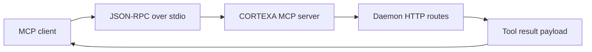

# MCP Server Transport Guide

CORTEXA includes a full **stdio MCP transport** for use in MCP-compatible clients (Claude Desktop, Cursor, etc.).

[← Back to README](../README.md)

---

## What this server provides

- JSON-RPC 2.0 framing over stdio (`Content-Length` transport)
- MCP lifecycle methods:
  - `initialize`
  - `tools/list`
  - `tools/call`
  - `resources/list` (empty)
  - `prompts/list` (empty)
  - `ping`
- Tool bridge into daemon routes (`/cxlink/*`, compaction, self-healing, ingest, evolve)
- MCP context codec tooling (`cortexa_encode_mcp_ctx`, `cortexa_decode_mcp_ctx`)

## Transport flow



| Tool family            | Examples                                           | Mutation                                 |
| ---------------------- | -------------------------------------------------- | ---------------------------------------- |
| Core retrieval         | `cortexa_query`, `cortexa_context`, `cortexa_plan` | no                                       |
| Proactive and temporal | `cortexa_context_suggest`, `cortexa_temporal_*`    | no                                       |
| Agent surface          | `cortexa_agent_list`, `cortexa_agent_run`          | list: no, run: yes                       |
| Branch controls        | `cortexa_branch_*`                                 | list: no, create/merge/switch: yes       |
| Compaction controls    | `cortexa_compaction_*`, `cortexa_self_heal_*`      | stats/dashboard/status: no, trigger: yes |

---

## Start the MCP server

```bash
pnpm run cortexa:mcp
```

For production/distribution runs (after build):

```bash
node dist/apps/mcp-server/src/server.js
```

---

## Tool surface (current)

Read-only tools:

- `cortexa_health`
- `cortexa_query`
- `cortexa_context`
- `cortexa_plan`
- `cortexa_context_suggest`
- `cortexa_agent_list`
- `cortexa_temporal_query`
- `cortexa_temporal_diff`
- `cortexa_branch_list`
- `cortexa_compaction_stats`
- `cortexa_compaction_dashboard`
- `cortexa_self_heal_status`
- `cortexa_encode_mcp_ctx`
- `cortexa_decode_mcp_ctx`

Mutation tools (disabled by default):

- `cortexa_ingest`
- `cortexa_evolve`
- `cortexa_agent_run`
- `cortexa_branch_create`
- `cortexa_branch_merge`
- `cortexa_branch_switch`
- `cortexa_self_heal_trigger`

Enable mutations with:

- `CORTEXA_MCP_ENABLE_MUTATIONS=true`

### Parameter highlights

- `cortexa_query`, `cortexa_context`, and `cortexa_plan` accept `branch` and `asOf` for branch-aware + temporal retrieval.
- `cortexa_ingest` accepts `branch` to ingest into non-`main` memory branches.
- `cortexa_context_suggest` supports `warmup`, `topK`, and `maxTokens` for proactive pre-compilation.
- `cortexa_temporal_query` requires `query`, `projectId`, and `asOf`.
- `cortexa_temporal_diff` requires `projectId`, `from`, and `to`.
- `cortexa_agent_run` requires `agent` + `text` and supports `projectId`, `branch`, `context`, `dryRun` (defaults to `true`), `topK`, `maxChars`, and `existingSnippets`.

---

## Environment variables

- `CORTEXA_MCP_SERVER_NAME` (default `cortexa-mcp`)
- `CORTEXA_MCP_SERVER_VERSION` (default `0.1.0`)
- `CORTEXA_MCP_PROTOCOL_VERSION` (default `2024-11-05`)
- `CORTEXA_MCP_DAEMON_URL` (default `http://127.0.0.1:4312`)
- `CORTEXA_MCP_DAEMON_TOKEN` (optional, used for daemon auth)
- `CORTEXA_MCP_TIMEOUT_MS` (default `20000`)
- `CORTEXA_MCP_ENABLE_MUTATIONS` (default `false`)
- `CORTEXA_MCP_LOG_LEVEL` (`debug|info|warn|error`, default `info`)

---

## Claude Desktop example

Use your built server path and daemon token:

```json
{
  "mcpServers": {
    "cortexa": {
      "command": "node",
      "args": ["C:/Users/ayana/Projects/Cortexta/dist/apps/mcp-server/src/server.js"],
      "env": {
        "CORTEXA_MCP_DAEMON_URL": "http://127.0.0.1:4312",
        "CORTEXA_MCP_DAEMON_TOKEN": "replace-with-secure-token",
        "CORTEXA_MCP_ENABLE_MUTATIONS": "false"
      }
    }
  }
}
```

---

## Security posture

- Keep mutation tools disabled for read-only assistant profiles.
- Prefer daemon token auth (`CORTEXA_DAEMON_TOKEN`) and pass it as `CORTEXA_MCP_DAEMON_TOKEN`.
- Restrict daemon bind exposure to trusted local networks unless reverse-proxied securely.
