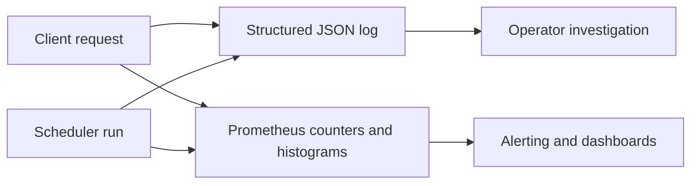

# Observability Guide

This guide covers production observability for the CORTEXA daemon.

[← Back to README](../README.md)

---

## What is included

- **Structured JSON logs** from daemon HTTP, self-healing, and session-resurrection scheduler flows.
- **Prometheus metrics export** (`/metrics`) for HTTP latency, request volume, in-flight traffic, and scheduler outcomes.
- **Health diagnostics** (`/health`) including observability configuration and scheduler telemetry.

## Signal pipeline



| Signal                       | Source                                         | Useful for                         |
| ---------------------------- | ---------------------------------------------- | ---------------------------------- |
| HTTP completion log          | daemon HTTP middleware                         | request triage and latency tracing |
| Scheduler completion log     | self-healing and session-resurrection services | run outcome debugging              |
| Request counter and duration | `/metrics`                                     | SLO and route health monitoring    |
| Consecutive failure gauges   | `/metrics`                                     | scheduler degradation detection    |
| `/health` status payload     | daemon health route                            | readiness and control-plane checks |

---

## Structured logging

CORTEXA daemon emits JSON logs with fields such as:

- `service`
- `component`
- `requestId`
- `method`
- `route`
- `statusCode`
- `durationMs`

Sample log:

```json
{
  "level": "info",
  "time": "2026-04-19T12:20:04.551Z",
  "service": "cortexa-daemon",
  "component": "http",
  "message": "http.request.completed",
  "requestId": "m3l8a6u8-2j9d84fx",
  "method": "POST",
  "route": "/cxlink/context",
  "statusCode": 200,
  "durationMs": 37
}
```

---

## Prometheus metrics

By default, daemon metrics are available at:

- `GET /metrics`

If `CORTEXA_DAEMON_TOKEN` is configured, metrics require token auth by default.

### Key custom metrics

- `cortexa_daemon_http_requests_total{method,route,status_code}`
- `cortexa_daemon_http_request_duration_seconds{method,route,status_code}`
- `cortexa_daemon_http_inflight_requests`
- `cortexa_daemon_self_healing_runs_total{trigger,outcome}`
- `cortexa_daemon_self_healing_run_duration_seconds{trigger,outcome}`
- `cortexa_daemon_self_healing_consecutive_failures`
- `cortexa_daemon_session_resurrection_runs_total{trigger,outcome}`
- `cortexa_daemon_session_resurrection_run_duration_seconds{trigger,outcome}`
- `cortexa_daemon_session_resurrection_consecutive_failures`

### Process/runtime metrics

When enabled, default process metrics are exported under prefix:

- `cortexa_daemon_process_*`

---

## Environment variables

### Logging

- `CORTEXA_LOG_ENABLED` (default `true`)
- `CORTEXA_LOG_LEVEL` (`trace|debug|info|warn|error|fatal`, default `info`)

### Metrics

- `CORTEXA_METRICS_ENABLED` (default `true`)
- `CORTEXA_METRICS_PATH` (default `/metrics`)
- `CORTEXA_METRICS_REQUIRE_AUTH` (default `true`)
- `CORTEXA_METRICS_COLLECT_DEFAULTS` (default `true`)

### Rate limiting

- `CORTEXA_DAEMON_RATE_LIMIT_ENABLED` (default `true`)
- `CORTEXA_DAEMON_RATE_LIMIT_WINDOW_MS` (default `60000`)
- `CORTEXA_DAEMON_RATE_LIMIT_MAX` (default `240`)

---

## Prometheus scrape example

```yaml
scrape_configs:
  - job_name: cortexa-daemon
    metrics_path: /metrics
    static_configs:
      - targets: ['localhost:4312']
    scheme: http
    authorization:
      type: Bearer
      credentials: "replace-with-secure-token"
```

---

## Operational notes

- Keep route labels low-cardinality; CORTEXA normalizes dynamic path segments where possible.
- Leave `CORTEXA_METRICS_REQUIRE_AUTH=true` for non-local deployments.
- Pair `/health` checks with metrics-based alerts for latency/error windows.
