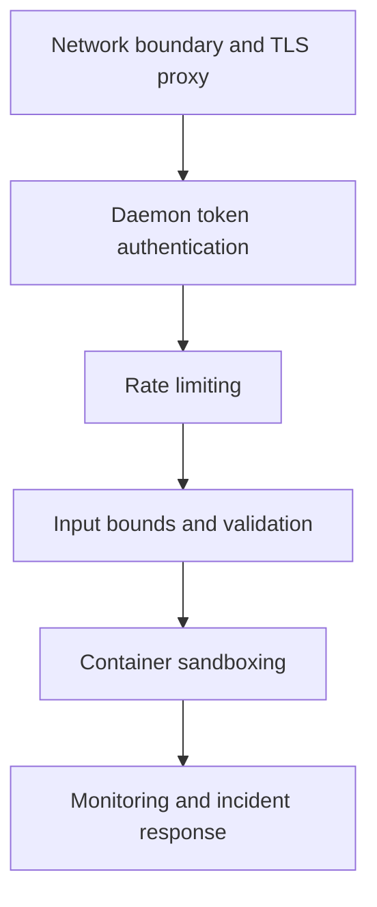

# Security Hardening Guide

This guide outlines practical hardening controls for CORTEXA daemon and container deployments.

[← Back to README](../README.md)

## Defense-in-depth model

| Layer                  | Primary controls                             | Failure mode reduced                   |
| ---------------------- | -------------------------------------------- | -------------------------------------- |
| Edge/network           | TLS proxy, ACLs, private exposure            | unauthorized internet reachability     |
| Identity               | `CORTEXA_DAEMON_TOKEN`, metrics auth         | unauthenticated API access             |
| Abuse control          | request window and max limits                | brute-force and burst overload         |
| Input safety           | bounded parsing and body limits              | malformed/oversized payload impact     |
| Runtime isolation      | non-root containers, capability minimization | container breakout blast radius        |
| Detection and response | logs, metrics, token rotation                | slow detection and prolonged incidents |

---

## 1) Authentication and access control

- Set `CORTEXA_DAEMON_TOKEN` to a strong random secret in non-local environments.
- Keep `CORTEXA_METRICS_REQUIRE_AUTH=true` so `/metrics` is not publicly exposed.
- Avoid exposing daemon ports directly to the public internet.

Recommended minimum:

- bind daemon behind a reverse proxy with TLS
- enforce network ACLs
- rotate daemon tokens on schedule

---

## 2) Rate limiting

Daemon includes built-in request rate limiting.

Controls:

- `CORTEXA_DAEMON_RATE_LIMIT_ENABLED` (default `true`)
- `CORTEXA_DAEMON_RATE_LIMIT_WINDOW_MS` (default `60000`)
- `CORTEXA_DAEMON_RATE_LIMIT_MAX` (default `240`)

Tune these based on expected client concurrency and threat model.

---

## 3) Input validation and sanitization

Current protections include:

- bounded payload parsing (`toBoundedInt`, `toBoundedNumber`, `toTrimmedString`)
- JSON syntax handling with explicit `400` responses
- safe defaults for route options and limits

Recommended operator controls:

- keep `CORTEXA_DAEMON_BODY_LIMIT` conservative for your workload
- reject unknown fields at gateway/API-proxy layers for strict schemas
- add WAF rules for abusive request patterns

---

## 4) Container sandboxing

Current container baseline:

- non-root runtime user in `Dockerfile`
- persistent data under scoped volume path
- explicit exposed ports and healthcheck

Recommended production hardening:

- run with read-only root filesystem when possible
- drop unnecessary Linux capabilities
- apply memory/CPU limits
- use seccomp/apparmor profiles
- avoid mounting host Docker socket

---

## 5) Secrets management

- Never commit real secrets into `.env` or source control.
- Prefer secret stores (e.g., Azure Key Vault, Vault, GH Environments, etc.).
- Ensure token values are injected at runtime, not baked into images.

---

## 6) MCP safety guidance

- Keep `CORTEXA_MCP_ENABLE_MUTATIONS=false` for read-only assistants.
- If enabling mutation tools, isolate MCP clients per environment (dev/staging/prod).
- Audit tool-call activity through daemon structured logs and request IDs.

---

## 7) Incident response basics

- Monitor:
  - `cortexa_daemon_http_requests_total`
  - `cortexa_daemon_http_request_duration_seconds`
  - `cortexa_daemon_self_healing_runs_total`
- Alert on sustained 401/429 spikes or abnormal self-healing `error` outcomes.
- Rotate credentials and review recent request IDs during incident triage.
